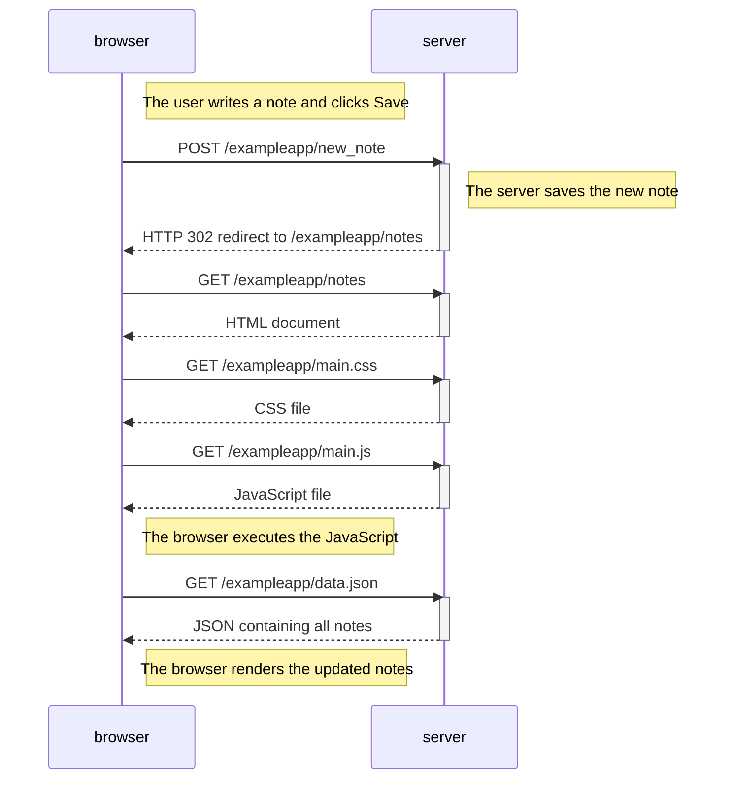

# Exercise 0.4

```mermaid
sequenceDiagram
    participant browser
    participant server

    Note right of browser: The user writes a note and clicks Save

    browser->>server: POST /exampleapp/new_note
    activate server
    Note right of server: The server saves the new note
    server-->>browser: HTTP 302 redirect to /exampleapp/notes
    deactivate server

    browser->>server: GET /exampleapp/notes
    activate server
    server-->>browser: HTML document
    deactivate server

    browser->>server: GET /exampleapp/main.css
    activate server
    server-->>browser: CSS file
    deactivate server

    browser->>server: GET /exampleapp/main.js
    activate server
    server-->>browser: JavaScript file
    deactivate server

    Note right of browser: The browser executes the JavaScript

    browser->>server: GET /exampleapp/data.json
    activate server
    server-->>browser: JSON containing all notes
    deactivate server

    Note right of browser: The browser renders the updated notes
```