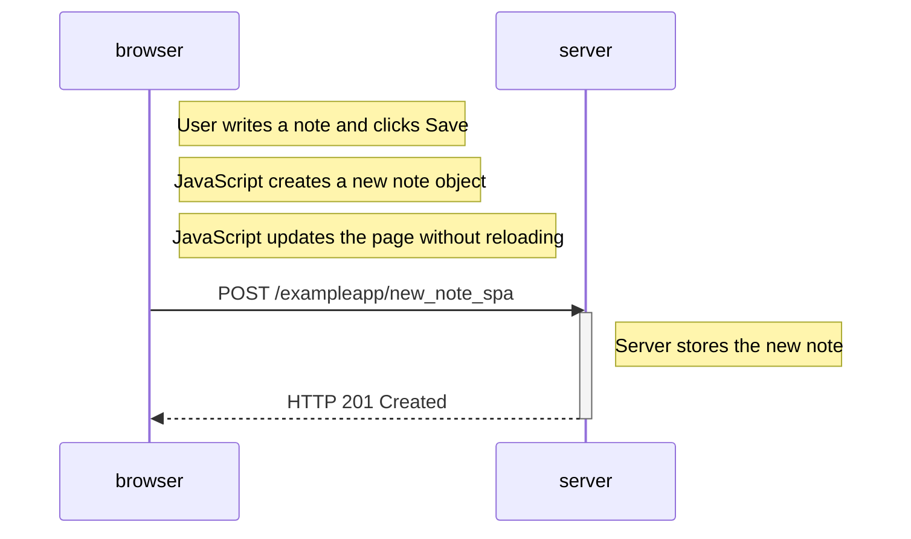

# Exercise 0.6

```mermaid
sequenceDiagram
    participant browser
    participant server

    Note right of browser: User writes a note and clicks Save
    Note right of browser: JavaScript creates a new note object
    Note right of browser: JavaScript updates the page without reloading

    browser->>server: POST /exampleapp/new_note_spa
    activate server
    Note right of server: Server stores the new note
    server-->>browser: HTTP 201 Created
    deactivate server
```